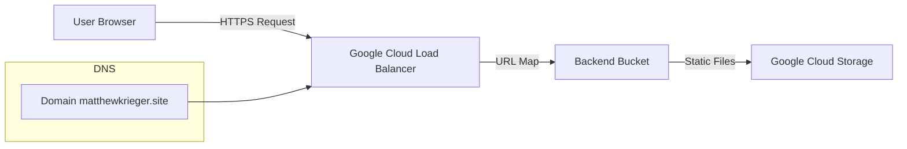

# Week 2 Project: Static Website Hosting with Google Cloud Load Balancer

## Overview
-This project demonstrates how to host a static website on Google Cloud Storage
and serve it securely over HTTPS using a Google Cloud HTTPS Load Balancer with
a custom domain.  

## Architecture

## Steps to complete setup (All done in GCP Console):  
-Create GCS Bucket  
(Cloud Storage -> Buckets -> Create)  

-Configure bucket  
(Region: Multi, Allow Public Access, Uniform Access Control)  

-Upload website files  

-Make files public  
(Principal: allUsers, Role: Storage Object Viewer)  

-Enable website hosting
(Bucket -> Edit website configuration -> Set Index page suffix to index.html)  

-Set up load balancer  
(Network Services -> Load Balancing -> Create Load Balancer ->  
Application Load Balancer -> Public Facing -> Global Workloads ->  
Global External Application Load Balancer -> Configure)  

-Configure load balancer  
(Frontend: Protocol: HTTPS, IP Version: IPv4, IP Address: Static,  
Port: 443, Create New Certificate -> Create Google-managed certificate)  
(Backend: Create Backend Bucket -> Select Storage Bucket, Enable Cloud CDN,  
Cache Static Content, Allow public access to Cloud CDN content)  
(Routing Rules: Simple host and path rule, all others set to default)  

-Add A records to DNS settings on Namecheap to point to static IP address  
  
-Verify functionality  
(curl -I https://matthewkrieger.site)  
  

