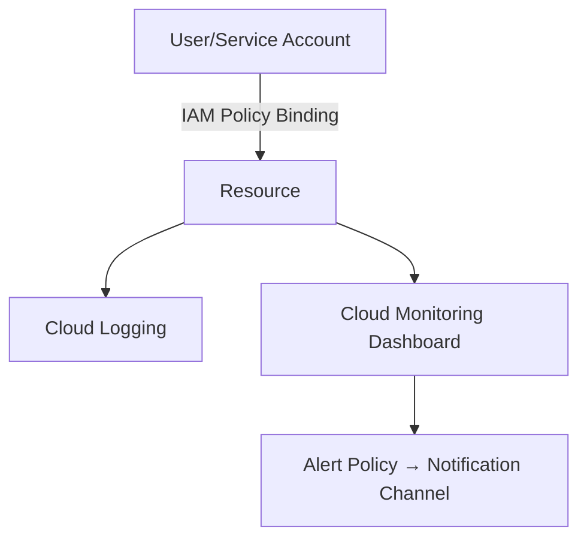

# Project 3: IAM & Logging Best Practices

## Overview
This project demonstrates how to:  
-Apply principle of least privilege using IAM custom roles and service accounts  
-Remove unnecessary Owner/Editor roles  
-Enable Cloud Logging & Monitoring for observability  
-Create dashboards and alerts for proactive monitoring  

---

## Part 1: IAM Best Practices

## Step 1: Review Existing Roles
-Go to IAM & Admin -> IAM  
-Review roles  
-Remove unnecessary Editor role from secondary user  

## Step 2: Create a Custom Role
-Go to IAM & Admin -> Roles -> Create Role  
-Role Name: ComputeEngineBasicOps  
-Add permissions: compute.instances.start, compute.instances.stop, compute.instances.get  
-Assign custom role to secondary user  
-Create  

## Step 3: Create a Service Account
-IAM & Admin -> Service Accounts -> Create Service Account  
-Assign custom ComputeEnginBasicOps role  

---

## Part 2: Enable Cloud Logging and Monitoring

## Step 1: Enable Logging
-Enable Cloud Logging API  
-Check logs:  
-Compute Engine -> VM Instances -> View Logs Tab  
-Verify HTTP requests for VM  

## Step 2: Create a Monitoring Dashboard
-Monitoring -> Dashboards -> Create Custom Dashboard  
-Add Widget - Gauge - VM Instance - CPU utilization  
-Add Widget - Line - VM Instance - Sent Bytes  
-Add Widget - Line - Global External Application Load Balancer Rule - Total latency  

## Step 3: Create an Alert Policy
-Monitoring -> Alerting -> Create Policy  
-VM Instance - CPU Utilization  
-Trigger: Any time series violates - Above Threshhold - 80%  
-Notification Channels - Email

---

## Architecture

