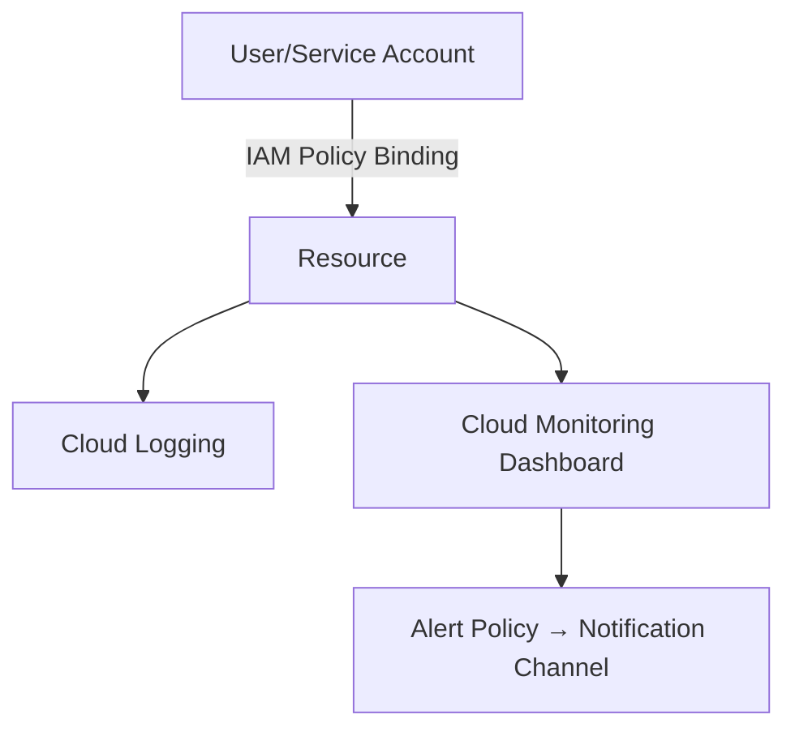

# Project 3: IAM & Logging Best Practices

## Overview
This project demonstrates how to:  
-Apply principle of least privilege using IAM custom roles and service accounts  
-Remove unnecessary Owner/Editor roles  
-Enable Cloud Logging & Monitoring for observability  
-Create dashboards and alerts for proactive monitoring  

---

## Architecture

